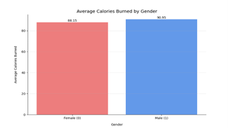

# Calories_Prediction

The files in this folder are the files that were used to create a data science project that preidtcs the number of calories burned using XGBoost library in Python and produce the results to a CSV file that is then consumed by a PowerBI report, below are the full steps to recreate the project. I am always happy to listen to feedback and recommendations or provide support to people learning data science so feel free to drop me a message or download and user the files for your development.

## Reseach Question

How does the different features of a physical gym workout and person affect the predicted number of calories that are burned.

## Summary

The project aim was to understand the features that affect the target variable (calories burned) allowing for a model to be created with over 90% accuracy that predicts the number of calories burnt using the features of the dataset. 

The model used was XGBoost utilising python for the coding element and visualisations in PowerBI allowing deeper trend analysis. The model can be accessed via GitHub - https://gordondoggett-ds.github.io/Portfolio/. The model produced an R2 score of 99.7% and an MAE of 2.44 which represents a highly accurate model.

During the research, papers for previously completed calorie prediction models was utilised supporting the model choice decision, saving time of trialling different models. Although the paper suggest that LightGBM may be the best model to use it compares the use of 7 different models and discusses the “remarkable performance and adaptability in regression problems” (Tan, Zarina Che Embi and Hashim, 2024).

A hypothesis made was that males will burn a significantly higher number of calories than females, the results disprove this hypothesis as shown in Fig1.

Fig1. Below show the number of calories burned split by gender which although males do typically burn more calories this is not by a significant margin.

