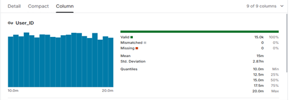
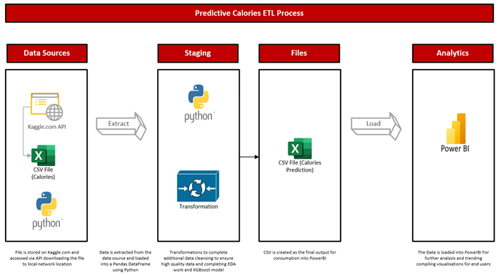
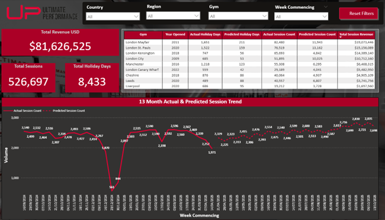
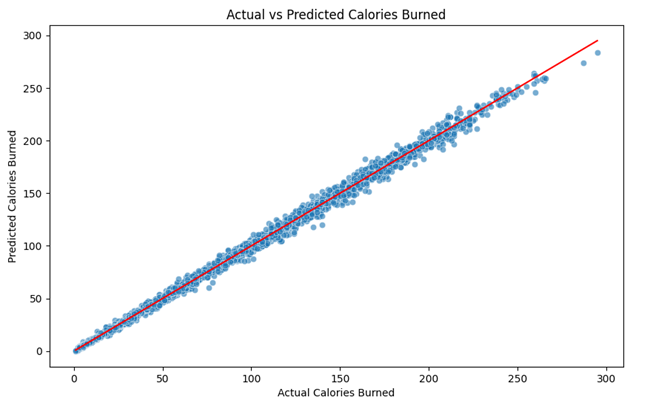
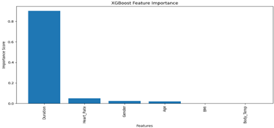
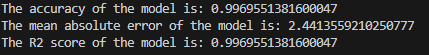
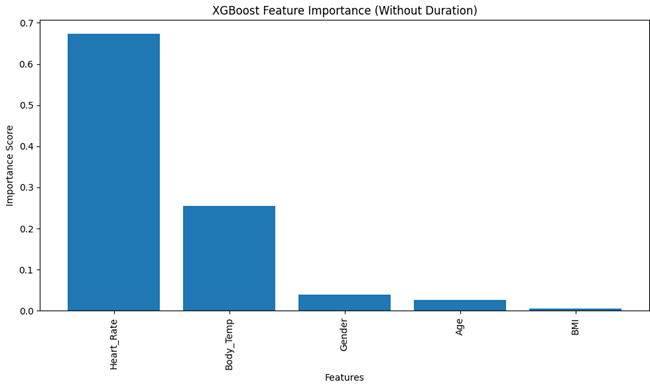
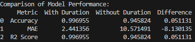

# Calories_Prediction

The files in this folder are the files that were used to create a data science project that preidtcs the number of calories burned using XGBoost library in Python and produce the results to a CSV file that is then consumed by a PowerBI report, below are the full steps to recreate the project. I am always happy to listen to feedback and recommendations or provide support to people learning data science so feel free to drop me a message or download and user the files for your development.

## Reseach Question

How does the different features of a physical gym workout and person affect the predicted number of calories that are burned.

## Summary

The project aim was to understand the features that affect the target variable (calories burned) allowing for a model to be created with over 90% accuracy that predicts the number of calories burnt using the features of the dataset. 

The model used was XGBoost utilising python for the coding element and visualisations in PowerBI allowing deeper trend analysis. The model produced an R2 score of 99.7% and an MAE of 2.44 which represents a highly accurate model.

During the research, papers for previously completed calorie prediction models was utilised supporting the model choice decision, saving time of trialling different models. Although the paper suggest that LightGBM may be the best model to use it compares the use of 7 different models and discusses the “remarkable performance and adaptability in regression problems” (Tan, Zarina Che Embi and Hashim, 2024).

A hypothesis made was that males will burn a significantly higher number of calories than females, the results disprove this hypothesis as shown in Fig1.

*Fig1. Below show the number of calories burned split by gender which although males do typically burn more calories this is not by a significant margin.*

## Data Infrastructure & Tools

The data tool used in this are as follows:

•	API – used to collect the data from Kaggle enabling automation of the data feed and removing human error risk.

•	Python – programming language utilised as it’s widely utilised in the data science industry and has a vast number of pre-built libraries, R was considered, Python was chosen due to being a more general language with wider audience exposure. The downside is that libraries can become deprecated or out of date quickly.

•	PowerBI – chosen for the visualisation of the results, its powerful analytical features making trends and patterns easier to spot. Tableau was considered but is a less exposed tool in the data industry. 

•	GitHub – host the code easily linking to data science portfolios, this helped to demonstrate knowledge of different methods and models, GitHub is free to use and easy to setup. It enables version controlling providing opportunity for feedback and recommendations. The disadvantage of using GitHub is that it the steeper learning curve.

The combination of the above tools allowed for a detailed version-controlled data science project creation following industry best practices whilst showcasing different tools and purposes during different stages of the project.

## Data Engineering

The public dataset from Kaggle with 15,000 records was used, the dataset can be used for multiple data science projects including analysing trends and prediction models, data can be found [here](https://www.kaggle.com/datasets/ruchikakumbhar/calories-burnt-prediction).

The dataset has a usability of 10 on Kaggle due to its completeness, credibility and compatibility. As mentioned in (Gupta, 2023) “The rule of ten states that it costs ten times as much to complete a unit of work when the data is flawed than when the data is perfect”. Kaggle has a data quality feature as shown in Fig2.

*Fig2. Statistics of User_ID column from Kaggle dataset, showing a quick overview of the quality of data to quickly identify usability.*

There is no reference as to how the data was generated and therefore there is no guarantee this is not synthetic data that has been created but upon examination of the data and applying knowledge of the health and fitness industry it does appear to be real life data.

Creating a final output of columns and an ETL diagram was part of the data engineering phase of the project after selecting the data source and subject, Appendix 1 & 2 shows the plan of the final output of columns. Fig3 show the ETL diagram and flow of data.

*Fig3. The ETL process showing the flow of data including data cleansing and transformation before visualising in PowerBI. This flow allows full automation of processing the data to keep it upto date and retraining the model where required*

The data was loaded utilising the Kaggle API adding the data to a Pandas data frame. Additional data checks were performed identifying data quality as shown in Fig2. Additional EDA work is summarised below, but full code was be found in GitHub [here](https://github.com/GordonDoggett-DS/Calories_Prediction/tree/main/Python_Files).

•	Display basic information e.g.  data types and statistics

•	Update categorial variable to numeric values for Gender

•	Check for missing values and duplicates

•	Remove potential personal identifiers - not required and abides to data minimisation under GDPR

•	Graphs to check for data distribution and outliers

•	Correlation of features, feature engineering adding BMI

The reason why BMI was utilised was due to the correlation between height and weight therefore simplifying the model, removing the two variables reduces the chances of overfitting the model.

## Data Visualisation & Dashboards

The data used in PowerBI is the CSV file that was produced at the end of the Python script, transforming as per the below steps:

•	Promoted first row to headers

•	Changed data types

•	Updated column names

•	Added grouping

•	Reordered columns 

The visualisations used in the report were aimed at an executive audience with a low technical ability, the report has minimal visualisations due to best practises to not utilise too many visualisations on a page as it affects performance and readability. 

The top of the report contains the report title and 2 slicers allowing filtering and segmented into different ages groups and genders. The most important information is stored in the top left corner of the report as user digest information from left to right so the first area of focus for end user is the top left.

A table of data with all the columns is placed in the nottom left of the page, this allows users such as finance teams to consume a tabular format and allows exporting of the data for further analysis. The 2 visuals placed on the right-hand side of the report were chosen to utilise different visualisations highlighting the split by gender and duration groups, deeper analysis is enabled via drilling through duration or gender categories. The bottom visual shows the accuracy of the model and allows segmentation by age group identifying outliers and trends.

The full report has minimal white space with interactivity allowing deeper analysis. The target audience wanted to see the high-level details straight away with minimal clicks, the full report page can be seen below in Fig4 or accessed [here](https://github.com/GordonDoggett-DS/Calories_Prediction/tree/main/PBIX_Files).

*Fig4. The full page view of the PowerBI Report created for the end user*

## Data Analytics

This project utilises an xgboost prediction model. The model allows for nonlinear relationships to be considered compared to linear regression, linear regression works in trying to fit to a straight line, it was suggested during literature research that the MAE would be higher for this subject.

The model utilises several different Python libraries to plot results and accuracy metrics, utilising the python scikit-learn library splitting into train/test datasets, calculating both the MAE score and r2 score, the model uses an industry standard of 80/20 split. Fig9 shows the results of the actual vs predicted values.

*Fig9. Scatter plot to show the actual vs predicted values, if the markers were on the line, it would represent a perfect prediction, as can be seen the markers on most data points are closer to the line representing an accurate model.*

The code reviews feature importance, this was a key part of the analysis relating directly to the original research question of which personal and workout features directly relate to the number of calories burned. The standout feature here shown in Fig10 is the duration of the workout.

*Fig10. Shows that duration has a large influence on predicting the calories burned where BMI and body temperature have a very small effect on the prediction and therefore could be removed to simplify the model.*

The accuracy of the model was tested to see how well it has predicted the calories burned. The scores shown in Fig11 highlights the model performs accurately with a R2 score showing 99.7% of variance in the target variable is predictable from the features. The MAE score 2.44 suggests on average that the predictions in the test set of data are 2.44 calories away from the actual value.

*Fig11. Shows the values returned to the screen in Python of the accuracy, MAE and R2 scores of the model.*

Feature importance and model accuracy was rerun. Fig12 shows the feature importance without the duration whilst Fig13 shows the updated accuracy.

*Fig12. The importance of the features with duration removed, heart rate is now the most important feature to predict the calories burned where body temperature is now a more important feature than previously.*

*Fig 13. This shows the accuracy, R2 and MAE score of the model with and without the duration feature, although it has decreased the accuracy, the MAE has increased the model is still accurate, but the prediction of calories burned is now on average out by 10.58 calories.*

When processing data through an analytical model it must be considered what is the purpose of processing the data, is there any legal or regulatory obligations to consider and does the data introduce bias to decision making. When designing the model these elements were taken into consideration and that is why check such as gender distribution, age distribution was complete during data processing.

## Recommendations

Recommendations for this project is inputting new data checking, how well the model would generalise with the updated dataset, having such a high R2 score could indicate overfitting or synthetic data. Introducing new real-world data would identify this concern.

Another improvement would be to remove the BMI and body temperature features due to the low feature importance and experiment with different variables reviewing model impact. 

Use the data and predictions to generate a personalised workout plan, based on the calories burnt requested producing a workout plan that can be devised with the duration considering the physical attributes of the individual.
